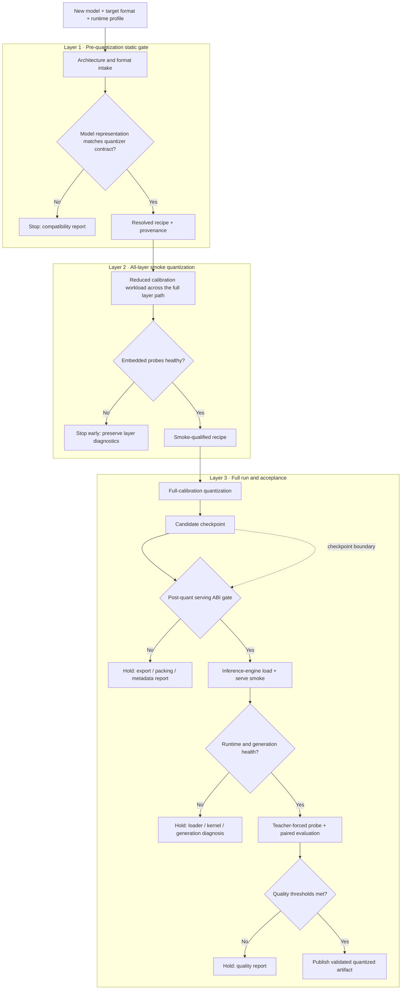

# Toward a Day-Zero Quantization Pipeline

> **Engineering field note · 14 July 2026**  
> Building a path from a newly released model to multiple validated, inference-ready quantized checkpoints.

The hard part of “automatic quantization” is not selecting four bits instead of sixteen. It is making three independently evolving systems agree: a new model architecture, a quantization algorithm, and an inference engine.

Our fork of `llm-compressor` is becoming the control plane for that agreement. The intended end state is straightforward to describe: provide a newly released model, request one or more target formats, and receive quantized candidates that have passed structural, runtime, and quality checks. The path to that end state is necessarily staged and conservative.

This note summarizes where we are, what MiniMax-M3 exposed, and the three-layer pipeline we are building around those lessons.

## The goal

The pipeline should accept:

- a source model and architecture;
- a target quantization algorithm, such as GPTQ or AWQ;
- a target numerical format, such as W4A16 or W4AFP8; and
- a target runtime and hardware profile.

It should return several candidate checkpoints with enough evidence to answer four separate questions:

1. Can the model representation satisfy the quantizer's expectations?
2. Did quantization execute the intended transformations across the intended layers?
3. Does the exported checkpoint satisfy the inference engine's loading contract?
4. Does the served model retain acceptable behavior relative to a baseline?

That separation matters. A checkpoint can be structurally valid but low quality; it can be numerically healthy but exported under the wrong names; or it can load successfully while silently omitting or misclassifying model components.

## The compatibility gap

New model releases regularly arrive before every quantization framework and inference backend has implemented an explicit profile for them. `llm-compressor` already advertises GPTQ, AWQ, W4AFP8, NVFP4, MXFP4, FP8, and other schemes, but a framework supporting a *format* does not imply that every new *architecture* is immediately safe under that format. [Supported upstream: LLM Compressor capabilities](https://github.com/vllm-project/llm-compressor)

We own the adaptation at two boundaries.

### Before quantization: adapt the model to the quantizer

The source model's configuration and module representation must match what the chosen algorithm expects. The compatibility layer needs to resolve, rather than guess:

- target and ignore rules;
- fused and linearized module layouts;
- group-size divisibility;
- AWQ smooth/balance mappings and hook targets;
- GPTQ weighted targets; and
- model-family details such as custom norms and MoE expert representation.

AWQ makes this boundary particularly algorithm-specific. The original AWQ method uses activation statistics to identify salient channels and applies equivalent per-channel scaling to reduce weight-quantization error. A wrong smooth/balance mapping can therefore produce a plausible-looking run that applies the wrong transformation. [Supported upstream: AWQ paper](https://arxiv.org/abs/2306.00978)

GPTQ interacts with the model differently: it uses approximate second-order information to quantize weights while compensating error within a block. A GPTQ-compatible target layout does not prove that an AWQ smoothing layout is correct, and vice versa. [Supported upstream: GPTQ paper](https://arxiv.org/abs/2210.17323)

### After quantization: adapt the checkpoint to the runtime

The inference engine is the fixed target. Our exporter or checkpoint-repair path must produce the names, packing, metadata, ignored-module policy, and tensor layout that the selected runtime expects.

We call this the checkpoint's serving **Application Binary Interface (ABI)**: the concrete contract between the saved artifact and the loader that reconstructs executable modules from it. It includes more than `config.json`; it covers the relationship among module namespaces, packed weights, scales, unquantized components, target declarations, and backend-specific expectations.

This boundary is why “the quantization job finished” is not an acceptance criterion.

## The three-layer pipeline

This is the high-level system we are implementing.

**Plain-text path:** intake → pre-quantization static gate → all-layer smoke quantization with live probes → full-calibration run → post-quantization serving ABI gate → runtime smoke → paired quality evaluation → publish or hold with evidence.

### Layer 1 — static compatibility gates

The pre-quantization gate operates before calibration data, real weights, or GPU work. It checks whether the model representation and the exact AWQ/GPTQ recipe can be combined structurally. The current implementation covers AWQ and GPTQ, with MiniMax-M3 as its first regression profile.

The post-quantization gate reads checkpoint metadata and tensor inventory without starting a GPU server. For the documented MiniMax-M3 `compressed-tensors` profile, it checks source-to-runtime aliases, packed/plain collisions, scales, ignore rules, and target policy.

These checkers are not yet universal. The direction is explicit model-family and format profiles—versioned adapters for common dense, MoE, and multimodal families—inside a model-agnostic orchestration layer. Unknown architectures, formats, or backends must fail as unsupported rather than silently pass.

### Layer 2 — all-layer smoke quantization with embedded probes

The earlier representative-layer canary is no longer the main path. A canary can accidentally exercise a different trace or lifecycle from production, making the diagnostic itself a confounder.

The replacement is a guarded, **all-layer** quantization using a reduced calibration workload. It follows the production layer path while saving time. Embedded probes verify that:

- sequential targets actually partition and execute;
- intended AWQ/GPTQ mappings are resolved and completed;
- calibration reaches the expected modules;
- scales and reconstructed values remain numerically healthy; and
- per-layer progress and provenance are durable before the next expensive step.

A confirmed violation writes the diagnostic record first, then terminates the run. The objective is not merely to fail faster; it is to fail with enough localization that the next run tests a specific hypothesis.

### Layer 3 — full calibration and end-to-end acceptance

Only a smoke-qualified recipe advances to the full calibration set. The resulting checkpoint then passes through the post-quantization ABI gate, a bounded inference-engine smoke, generation-health checks, a paired teacher-forced distributional probe, and task evaluation against comparator checkpoints.

Static success remains necessary but insufficient. It cannot prove tensor values, activation semantics, kernel correctness, KV-cache behavior, or model quality. The final acceptance decision belongs to the paired runtime and evaluation evidence.

## What MiniMax-M3 taught us

MiniMax-M3 compressed a large amount of debugging into one useful lesson: different failure boundaries need different discriminators.

| Artifact | What the evidence says | Current use |
|---|---|---|
| Original in-house GPTQ | Failed the CPU-only serving ABI gate with 228 runtime namespace/ignore mismatches. | Held; not a valid serving baseline. |
| Metadata-repaired in-house GPTQ | A portable overlay changed configuration metadata while preserving the tensor payload and Safetensors index; it passed preflight and produced coherent smoke generations. | Working in-house GPTQ candidate for controlled evaluation. |
| External AWQ control | Passed the same static preflight and completed the paired 2,047-token teacher-forced probe and small smoke suite without empty outputs or periodic loops. | Comparator/control, not evidence that our in-house AWQ recipe is correct. |
| In-house AWQ W4AFP8 | Full-calibration output remained unhealthy; later repair builds did not produce a completed replacement checkpoint, and some diagnostic harnesses exposed their own tracing/lifecycle failures. | Unresolved; continue through guarded all-layer diagnostics. |

**Observed in this fork:** the repaired GPTQ and external AWQ control each completed the small five-task smoke workflow and generation-health checks. Those scores are diagnostic samples, not statistically meaningful benchmark conclusions. See [the compact GPTQ/AWQ report](../M3_3MODEL_GPTQ_AWQ_FINAL_REPORT.md).

The direct GPTQ failure was not a harmless warning. The checker found 21,888 routed-expert modules packed under one namespace while 57 routers and 171 shared-expert projections were plain under runtime names not covered by the checkpoint's ignore rules. The metadata-only overlay added the runtime aliases without changing tensor payloads; coherent generation after repair validated the boundary diagnosis. See the [static gate report](../M3_STATIC_ABI_GATE_REPORT.md), [repaired preflight report](../M3_GPTQ_REPAIRED_ABI_PREFLIGHT_REPORT.md), and [status/roadmap](quantization-static-serving-preflight-status-and-roadmap.md).

The first real pre-quantization CLI run also justified Layer 1: it stopped on a meta-device MoE offload incompatibility before loading calibration data or allocating a GPU. A narrow guard and CPU regression coverage now exist, while cluster verification of the real command remains pending. See [the pre-quantization report](../M3_PREQUANT_REAL_CLI_FAILURE_REPORT.md).

### Current implementation status

| Area | Status | Boundary |
|---|---|---|
| Pre-quant AWQ/GPTQ structural planner | Implemented; MiniMax-M3 regression profile; real cluster rerun pending after local fix | Model → quantizer |
| MiniMax-M3 post-quant ABI checker | Proven on the documented `compressed-tensors` profile | Checkpoint → vLLM loader |
| Guarded all-layer diagnostic runner | Implemented with durable abort/progress evidence | Quantization lifecycle |
| Repaired in-house GPTQ smoke | Coherent, suitable for the next controlled comparison | Runtime health |
| In-house AWQ W4AFP8 | Unresolved | Algorithm-specific quality |
| General model-family profiles | Planned | Coverage expansion |
| Multimodal calibration | Deferred | Future work |

## Problem 2: multimodality

Multimodal models add a second calibration problem: the text and non-text token streams can have materially different activation distributions and sensitivity to quantization error. Recent VLM quantization research reports exactly this calibration mismatch between visual and text tokens. [Supported upstream: VLM calibration study](https://arxiv.org/abs/2602.07899)

A robust multimodal pipeline will eventually need modality-aware sample construction, processor artifacts, placeholder/token alignment, and evaluation that exercises each supported modality. For now, we are deliberately hardening the text path first. Multimodal quantization remains future work rather than an implied capability of the current gates.

## Problem 3: official-checkpoint fallback

Official NVFP4 checkpoints are valuable as quality and memory baselines, especially when reproducing the original quantization recipe is expensive.

The initial shorthand for Hopper fallback needs one correction. Current vLLM includes an FP4 Marlin path that supports FP4 weight-only execution on SM80+ hardware, including Hopper. The kernel consumes packed FP4 weights and higher-precision activations; it is more precise to call this an **NVFP4-weight / A16-style execution path** than a runtime conversion of the checkpoint into a new W4A16 checkpoint. The storage benefit remains, and weight bandwidth can still improve, but Hopper does not gain Blackwell's native NVFP4 Tensor Core path. [Supported upstream: vLLM FP4 Marlin source/API](https://docs.vllm.ai/en/v0.11.2/api/vllm/model_executor/layers/quantization/utils/marlin_utils_fp4/) and [vLLM hardware table](https://docs.vllm.ai/en/stable/features/quantization/index.html)

NVIDIA's own CUDA documentation distinguishes NVFP4 GEMM support on Blackwell from FP8 inputs on Hopper. [Supported upstream: CUDA library release notes](https://docs.nvidia.com/cuda/pdf/CUDA_Toolkit_Release_Notes.pdf)

There is also a separate vLLM emulation utility that dequantizes NVFP4 tensors back to a higher-precision dtype. That is useful for compatibility and diagnostics, but it is not the desired fast W4AFP8 compute path. [Supported upstream: vLLM NVFP4 emulation API](https://docs.vllm.ai/en/latest/api/vllm/model_executor/layers/quantization/utils/nvfp4_emulation_utils/)

**Proposed work:** investigate whether an official NVFP4 checkpoint can be adapted at load time into a W4AFP8/W4A8 execution path on Hopper—preserving four-bit weight storage while using FP8 activations and accepting a measurable quality trade-off. vLLM already contains a `compressed-tensors` W4A8-FP8 scheme, but we found no official path that directly and faithfully converts an arbitrary NVFP4 checkpoint into that scheme at runtime. NVFP4's block scales and semantics make this more than a dtype cast. It likely requires an explicit loader/repacking adapter and possibly a custom kernel or kernel integration.

This would be a stronger comparator for our in-house W4AFP8 checkpoints than a weight-only A16 fallback, because it would compare two four-bit-weight/eight-bit-activation execution paths. It is also specialized systems work, so the next step is to review feasibility with colleagues who have kernel expertise before committing to implementation.

## Near-term plan

The immediate milestone is not “support every model.” It is narrower and measurable:

1. Produce working in-house MiniMax-M3 checkpoints for the common quantization algorithms we intend to support, starting with repaired GPTQ and a healthy AWQ path.
2. Run the all-layer smoke path with embedded probes before spending hours on each full calibration.
3. Export each candidate through a versioned MiniMax-M3/runtime compatibility profile.
4. Compare in-house candidates against the BF16 source, the external AWQ control, and relevant official checkpoints using identical prompts, probe corpora, manifests, runtime settings, and task definitions.
5. Report quality, memory, and throughput separately; do not use successful loading as a proxy for quality or reduced checkpoint size as a proxy for compute speed.
6. Generalize the gates one model family and storage format at a time, with corrupted and valid fixtures for every supported profile.

The longer-term product is model-agnostic orchestration backed by explicit compatibility knowledge—not a universal checker that guesses.

## Evidence and references

### Observed in this fork

- [Pre-quantization real CLI failure and local fix status](../M3_PREQUANT_REAL_CLI_FAILURE_REPORT.md)
- [Static serving ABI gate result](../M3_STATIC_ABI_GATE_REPORT.md)
- [Repaired GPTQ ABI preflight](../M3_GPTQ_REPAIRED_ABI_PREFLIGHT_REPORT.md)
- [Compact repaired-GPTQ versus external-AWQ smoke result](../M3_3MODEL_GPTQ_AWQ_FINAL_REPORT.md)
- [AWQ re-quantization status](../M3_AWQ_REQUANTIZATION_REPORT.md)
- [AWQ representative diagnostic and why it was superseded](../M3_AWQ_REPRESENTATIVE_RERUN_REPORT.md)
- [Static preflight status and model-family roadmap](quantization-static-serving-preflight-status-and-roadmap.md)
- Implemented entry points: [`prequant_compatibility.py`](../pipeline/prequant_compatibility.py), [`m3_serve_abi.py`](../pipeline/m3_serve_abi.py), and [`m3_guarded_full.py`](../pipeline/m3_guarded_full.py)

### Supported upstream

- [LLM Compressor repository and supported schemes](https://github.com/vllm-project/llm-compressor)
- [vLLM: LLM Compressor integration](https://docs.vllm.ai/en/latest/features/quantization/llm_compressor/)
- [AWQ paper](https://arxiv.org/abs/2306.00978)
- [GPTQ paper](https://arxiv.org/abs/2210.17323)
- [vLLM quantization hardware compatibility](https://docs.vllm.ai/en/stable/features/quantization/index.html)
- [vLLM FP4 Marlin implementation reference](https://docs.vllm.ai/en/v0.11.2/api/vllm/model_executor/layers/quantization/utils/marlin_utils_fp4/)
- [vLLM NVFP4 emulation implementation reference](https://docs.vllm.ai/en/latest/api/vllm/model_executor/layers/quantization/utils/nvfp4_emulation_utils/)
- [NVIDIA CUDA toolkit release notes](https://docs.nvidia.com/cuda/pdf/CUDA_Toolkit_Release_Notes.pdf)
- [VLM calibration study](https://arxiv.org/abs/2602.07899)

### Proposed work

- Model-family and format adapters behind a model-agnostic orchestrator.
- Healthy in-house AWQ W4AFP8 quantization for MiniMax-M3.
- Modality-aware calibration and evaluation.
- Feasibility study for NVFP4-checkpoint adaptation to a Hopper W4AFP8/W4A8 execution path.
