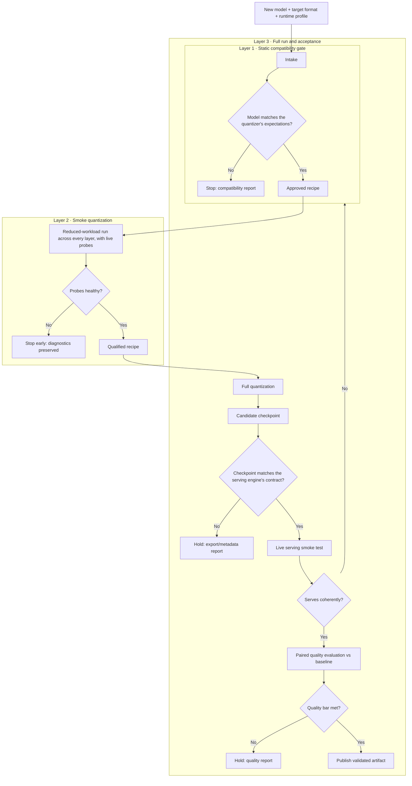

# Automatic Quantization Pipeline — Progress

> **Updated as of 31 July 2026.**
> Program status for PM readers. Per-goal detail and the week-by-week log live in
> [`PROJECT_GOALS.md`](../PROJECT_GOALS.md); the visual overview is
> [`automatic-quantization-pipeline-progress.html`](automatic-quantization-pipeline-progress.html).

<!-- EXTENSION POINT: keep this file current-state only. When something ships,
     refresh the headline bullets, the status table, and the date above.
     History belongs in PROJECT_GOALS.md's weekly log, not here. -->

## What we are building

A pipeline that takes a newly released model, a target quantization method, and a
target serving stack, and returns compressed checkpoints that have **proven** they
are safe to ship — structurally valid, loadable by the inference engine, and
quality-checked against the unquantized baseline. The hard part is not the
compression itself; it is making a new model architecture, a quantization
algorithm, and an inference engine agree — and catching every disagreement with
evidence before it reaches users.

## Where we are (31 July 2026)

- **Our 4-bit GPTQ model is fully validated and in service.** It recovers
  **97–101% of baseline quality across all seven benchmark tasks**, and a kernel
  upgrade made it about **34% faster** for a single user. This is the default
  served model.
- **The 4-bit AWQ model is fixed.** It shipped broken twice for two different
  root causes; both were diagnosed and repaired. The current recipe scores
  **within ~1% of baseline** on the tasks measured so far (full seven-task run
  still queued).
- **The speed target is met.** A complete quantization run finishes in
  **7 h 22 m** on one 8-GPU node — inside the 4–8 hour goal. The same
  parallel machinery then quantized a 30B model with a *different* method in
  **1 h 40 m**.
- **A third quantization method is onboarded** (AutoRound, targeting 2-bit
  models). The pipeline runs it end to end: quantize → serve → quality check.
  The first 2-bit model **did not pass the quality bar**; a longer-tuning retry
  is the named next step. The important part for the program: the pipeline
  measured this and blocked the ship, exactly as designed.
- **The evaluation pipeline works beyond one model.** It produced a paired
  three-way comparison on a second model family (GLM-5.2) with no rework of the
  method.
- **One approved future project:** running vendor-released NVFP4 checkpoints
  efficiently on current-generation (Hopper) GPUs. Design is done; all further
  investment is gated on a benchmark proof.

## How the pipeline decides a checkpoint is safe

Every candidate must pass three layers; failing any layer stops the run with an
evidence report rather than a half-working model.

Two principles worth restating because they have caught real defects:

- **"The job finished" is not acceptance.** A checkpoint can be structurally
  valid but low quality, numerically healthy but exported under names the
  serving engine rejects, or loadable while silently mis-serving parts of the
  model. Each layer targets one of those failure classes.
- **Negative results are deliverables.** The 2-bit no-ship verdict and the
  disqualification of an external community checkpoint (runaway generations)
  are the gates doing their job — both were measured, documented, and blocked.

## Status by area

| Area | Status |
|---|---|
| 4-bit GPTQ model (MiniMax-M3) | ✅ Validated on seven tasks; default served model; faster kernel adopted |
| 4-bit AWQ model (MiniMax-M3) | ✅ Fixed and near-baseline on measured tasks; full seven-task run queued |
| Quantization speed (4–8 h target) | ✅ Met (7 h 22 m); distributed path extended to a third method |
| Third method / 2-bit track (AutoRound) | ⏳ Pipeline complete end to end; first model failed the quality bar; retry queued |
| Evaluation pipeline | ✅ In production; proven on a second model family (GLM-5.2) |
| Compatibility gates for other model families | ⏳ Planned — gates are still MiniMax-M3-specific |
| Multimodal (image+text) calibration | ⏸ Deferred |
| NVFP4 on Hopper GPUs | 🔒 Approved, benchmark-gated; no hardware results yet |

## Next up

1. **2-bit retry with longer tuning** — the named fix for the failed quality bar.
2. **Seven-task quality run for the AWQ model** — closes its remaining evidence gap.
3. **Distributed save/export** — the last rough edge of the parallel quantization path.

## Where the details live

- [`PROJECT_GOALS.md`](../PROJECT_GOALS.md) — goals, sub-tasks, and the weekly log.
- [Program overview (HTML)](automatic-quantization-pipeline-progress.html) with
  per-goal field notes under [`docs/goals/`](goals/).
- Published results: [`M3_OFFICIAL_QUALITY_RESULTS.html`](../M3_OFFICIAL_QUALITY_RESULTS.html),
  [`M3_OFFICIAL_PERF_RESULTS.html`](../M3_OFFICIAL_PERF_RESULTS.html),
  [`GLM52_OFFICIAL_EVAL_RESULTS.html`](../GLM52_OFFICIAL_EVAL_RESULTS.html).
